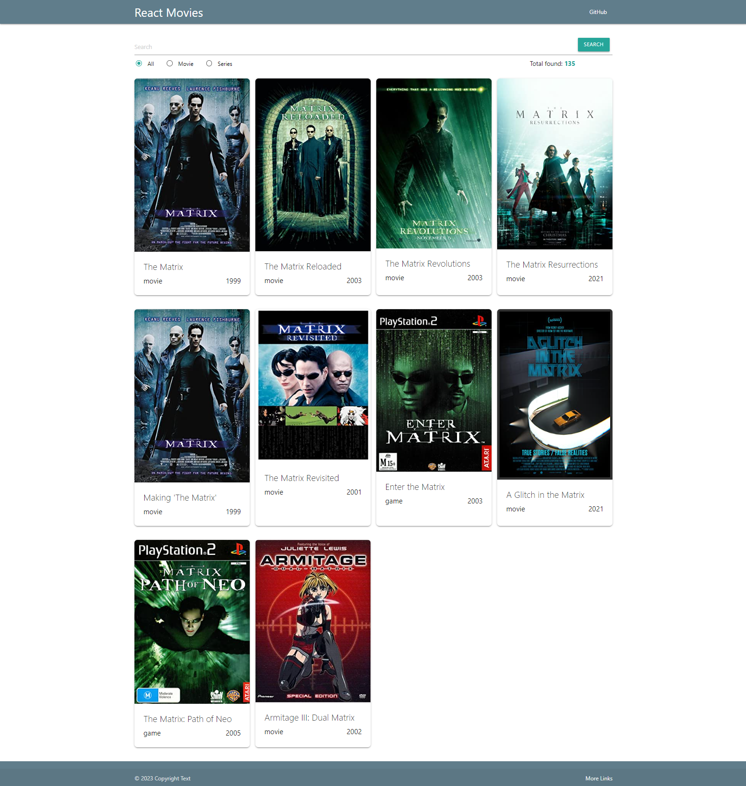

# React-movies

This project was bootstrapped with [Create React App](https://github.com/facebook/create-react-app).

A simple application on Reactjs.

## OMDb API

API - [OMDb API](https://www.omdbapi.com/)

The OMDb API is a RESTful web service to obtain movie information, all content and images on the site are contributed and maintained by our users.

## css components

The Materialize framework was chosen as css components. Provides a set of default components with simple customization.
A framework from Google was used as css components - [Materialize](https://materializecss.com/).

## Img Placehold

When the movie poster is not received from the API, the default browser placeholder is displayed. To avoid an empty poster, it was decided to use a service for generating images.

Image placeholder service - [Img Placehold](https://placehold.co/).

## Project - https://rebornoff.github.io/react-movies-practice/

## Application Interface

